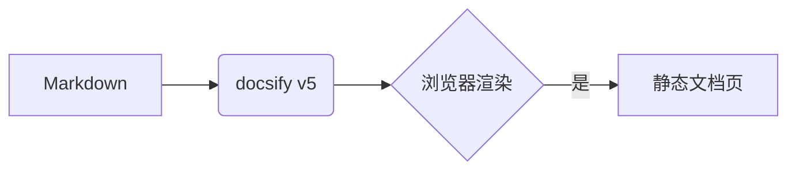
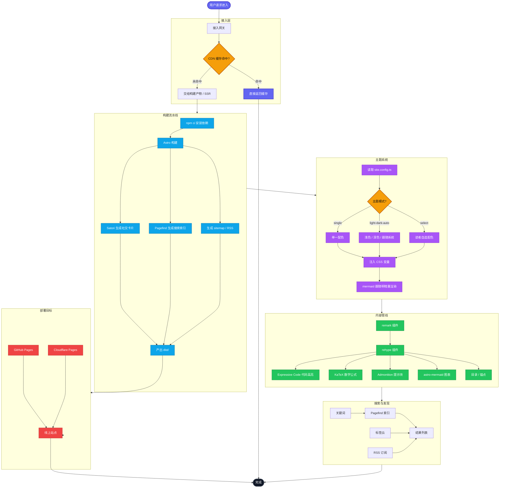

# PIKAQIANG'DOC

> 基于 **docsify v5** 的纯静态文档站 —— 无构建、零 Node/npm，所有资源离线在 `vendor/`。

文档由浏览器实时渲染 Markdown，主题与插件均按 [docsify 官网](https://docsify.js.org/) 推荐方式配置。

## 快速预览

```bash
./serve.sh          # 默认 http://localhost:3000
./serve.sh 8080     # 指定端口
```

> [!TIP]
> 只用 `python3 -m http.server`，没有任何 Node 相关依赖。

## v5 内置能力（无需插件）

> [!NOTE]
> 这类提示框（NOTE / TIP / IMPORTANT / WARNING / CAUTION）是 **docsify v5 原生 callout**，直接写 `> [!NOTE]` 即可。

> [!IMPORTANT]
> 侧边栏多级折叠也是 v5 内置（`collapsibleSidebarGroups`），见左侧「使用指南」。

> [!WARNING]
> 这是一个 WARNING 警告框。

> [!CAUTION]
> 这是一个 CAUTION 危险框。

## 代码复制

```python
def hello(name: str) -> str:
    return f"Hello, {name}!"

print(hello("PIKAQIANG"))
```

## 标签页

<!-- tabs:start -->

#### **Python**

```python
print("Hello from Python")
```

#### **JavaScript**

```javascript
console.log("Hello from JavaScript");
```

<!-- tabs:end -->

## Mermaid 图表（点击可放大）




## 数学公式（点击可放大）

行内公式：质能方程 $E = mc^2$。

块级公式（可点击放大）：

$$
\int_{-\infty}^{+\infty} e^{-x^2}\,dx = \sqrt{\pi}
$$

## 下一步

- 修改本文件更新首页；
- 在 `_sidebar.md` 增加目录条目；
- 在 `index.html` 中注释 / 取消注释来开关插件与主题；
- 更多说明见 [使用指南](guide.md) 和 [插件清单](plugins.md)。
